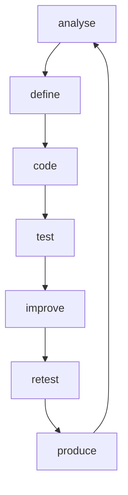

Presentation
-
Hello world, It's atlnet62.
- 🌱 I’m currently learning 
- I 'm a futur full stack JS Engineer.

Tools & Languages
-
 
 
       

Statistics
-

<!--

Routine to develop
-

-->  
**atlnet62/atlnet62** is a ✨ _special_ ✨ repository because its `README.md` (this file) appears on your GitHub profile.

Here are some ideas to get you started:

- 🔭 I’m currently working on ...
- 🌱 I’m currently learning ...
- 👯 I’m looking to collaborate on ...
- 🤔 I’m looking for help with ...
- 💬 Ask me about ...
- 📫 How to reach me: ...
- 😄 Pronouns: ...
- ⚡ Fun fact: ...
-->
